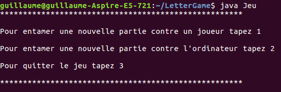
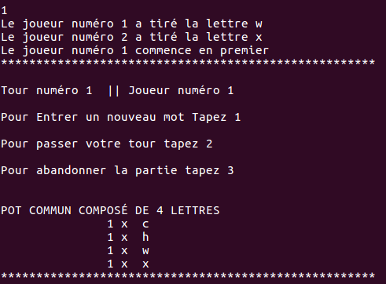
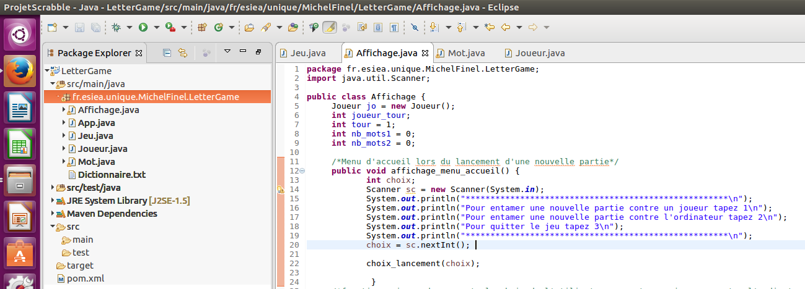
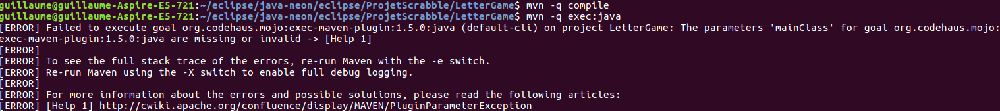
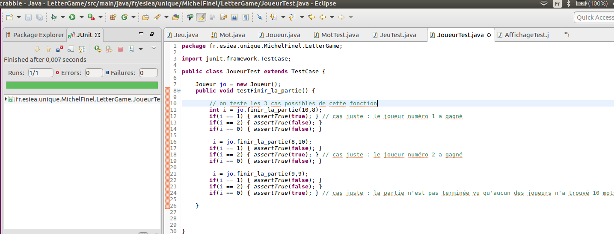

# Présentation de notre projet

# Membres 

- Guillaume Michel - TCSI1
- Dorian Finel-Bacha - TCSI1

# Découpage du projet

Notre projet  est découpé en 4 classe , Jeu.java, Affichage.java , Joueur.java , et Mot.java. 
  - Jeu : se contente de lancer le jeu en faisant appel à la classe "Affichage".
  - Affichage : Affiche l e menu et le déroulement du jeu, indique à l'utilisateur les choix qui s'offrent à lui ou toute autre information concernant le déroulement de la partie (mot erroné, fin de la partie, ajout des mots dans le pot commun).
  - Joueur : cette classe s'occupe des différentes informations concernant les joueurs( quel joueur doit jouer par exemple ?), elle sert en quelque sorte d'intermédiaire à la classe Affichage et à la classe Mot. 
  - Mot : met à jour les lettres présentes dans le pot et les mots composés par chaque joueur, s'occupe également de vérifier qu'un mot est présent dans le dictionnaire et qu'il y a les lettres nécessaires dans le pot commun pour le composer.

# Fonctionnalités
Lorsque le joueur lance le choix il peut "taper 1" pour affronter un second joueur, "taper 2" pour affronter l'ordinateur ou encore "taper 3" pour tout de suite quitter le jeu.




A chaque début de partie chaque joueur tire une lettre au hasard et commence si la lettre qu'il a tiré arrive avant la seconde lettre dans l'alphabet.

A noter que lors d'une partie contre l'ordinateur , l'ordinateur est toujours le joueur numéro 2.

Chaque fois qu'un joueur trouve un mot une lettre de plus est ajoutée au pot commun, et à chaque nouveau tour 2 lettres de plus sont ajoutés au pot commun.

A chaque nouveau tour le programme rappelle également les mots qui ont été trouvé par chaque joueur.

Lorsqu'un joueur trouve 10 mots il remporte la partie et le menu d'accueil lui propose de rejouer une nouvelle partie ou de quitter.

# Compilation du projet et Maven


Nous avons créé un projet maven sous Eclipse, le jeu compile sous Eclipse mais curieusement il ne s'éxécute pas correctement sous Maven en utilisant les commande maven suivantes de compilation et d'exécution : 
```
javac Jeu.java Affichage.java Joueur.java Mot.java
java Jeu
```


C'est pour cette raison qu'en plus du package créé sous Maven nous mettons également à disposition sur ce github une archive Lettergame.zip contenant tous les fichiers java (et les fichiers tests) ainsi que le fichier Dictionnaire.txt.

On peut donc tester le jeu en ouvrant le terminal depuis le dossier et en tapant les commandes suivantes :

```
mvn -q compile
mvn -q exec:java
```
# Tests unitaires

Nous avons réalisé les tests unitaires sous Maven, et ils sont également présent dans notre archive LetterGame.zip.




